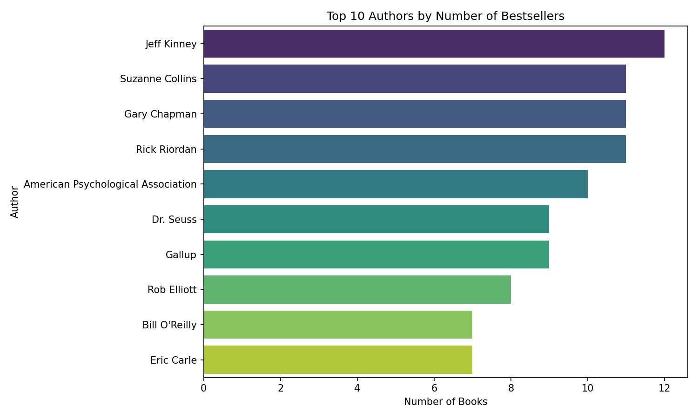

# 📚 Amazon Best-Selling Books Analysis

This project explores and analyzes a dataset of Amazon's best-selling books to uncover insights about genres, authors, and ratings.  
The dataset was sourced from Kaggle and analyzed using Python (Pandas, Matplotlib).

---

## 🔎 Project Overview
- Cleaned and explored the dataset of Amazon best-selling books.  
- Analyzed trends in ratings, genres, and publication years.  
- Identified top-performing authors and categories.  
- Created visualizations for clear insights.  

---

## 🛠️ Tools & Technologies
- **Python**  
- **Pandas** – data cleaning and analysis  
- **Matplotlib / Seaborn** – data visualization  
- **CSV Dataset (from Kaggle)**  

---

## 📊 Key Insights
- Fiction books tend to have slightly higher average ratings compared to non-fiction.  
- A small group of authors dominate the bestseller list.  
- Certain genres consistently rank higher in popularity and ratings.  

---

## 📂 Project Files
- `amazon_books_analysis.ipynb` → Jupyter Notebook with analysis.  
- `outputs/` → contains generated charts and results.  
- `bestsellers.csv` → dataset (or [link to Kaggle dataset](https://www.kaggle.com/)).  

---

## 📸 Sample Visualizations
| Top Authors by Number of Bestsellers | Rating Distribution |
|--------------------------------------|----------------------|
|  |  |

---

## 🚀 How to Use
1. Clone this repository.  
2. Open `amazon_books_analysis.ipynb`.  
3. Run the cells to view analysis and visualizations.  

---

## 🏆 Achievement
This project was part of my learning journey in Python and Data Analysis. It represents one of my first data-driven projects published publicly.  

---

